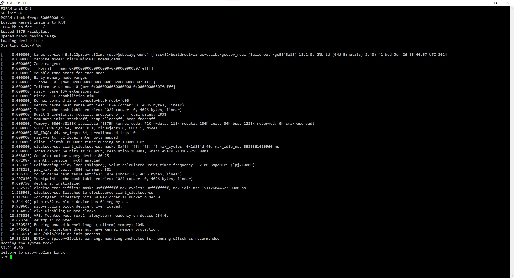

# pico-rv32ima
RISC-V emulator for RP2040, capable of running Linux.\
Based on [mini-rv32ima by CNLohr](https://github.com/cnlohr/mini-rv32ima).

## How it works
This project uses [CNLohr's mini-rv32ima](https://github.com/cnlohr/mini-rv32ima) RISC-V emulator core to run Linux on a Raspberry Pi Pico. It uses SPI PSRAM chips as system memory. To alleviate the bottleneck introduced by the SPI interface of the PSRAM, a 128 kilobyte cache is used.
## Requirements 
- a Raspberry Pi Pico (or other RP2040 board)
- an SD card
- one or two 8 megabyte (64Mbit) SPI PSRAM chips (I used LY68L6400).

_This project overvolts and overclocks the RP2040! Use at own risk!_

## How to use
The configuration can be modified in the [rv32_config.h](pico-rv32ima/rv32_config.h) file. A schematic with the pin mappings described here is included in [this file](hardware/pico_linux.kicad_sch).

- By default, the SD card is connected via SPI, with the following pinout:
    - CLK: GPIO2
    - MISO: GPIO0
    - MOSI: GPIO3
    - CS: GPIO5

- The RAM chips are connected with the following default pinout:
    - CLK: GPIO10
    - MISO: GPIO12
    - MOSI: GPIO11
    - CS1: GPIO13
    - CS2: GPIO14 (when using two RAM chips)

- The system console is accessible over USB-CDC or UART. Both can be used at the same time, but keep in mind that they point to the same virtual console. They can be enabled or disabled as desired in the config file. By default, only the USB console is enabled.

The SD card needs to be formatted as FAT16 or FAT32. Block sizes from 1024 to 4096 bytes are confirmed to be working. Prebuilt Linux kernel and filesystem images are provided in [the `linux` folder](linux/). They must be placed in the root of the SD card. If you want to build the image yourself, you need to run `make` in the [`linux`](linux) folder. This will clone the buildroot source tree, apply the necessary config files and build the kernel and system image.

## What it does
On powerup, board waits for the BOOTSEL button to be pressed. After it has been pressed, the Linux kernel will be copied into RAM. In a few seconds, kernel messages will start streaming on the console. The boot process takes around 30 seconds. The Linux image includes a fork of the [c4 compiler/interpreter](https://github.com/rswier/c4), the duktape JavaScript interpreter and the Lua interpreter, as well as a variety of Linux utilities and the coremark benchmark.

## Pictures
- Serial (USB or UART) console:
    - 
